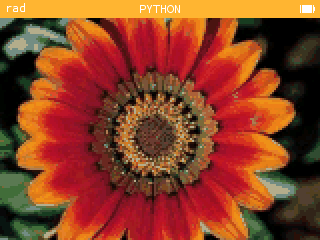

# Python Image Viewer for Numworks calculators

This small projects aims to inefficiently (but simply) compress images which can be then opened with an image viewer on the Numworks calculator, all running on the Python app.

This project is using the packages `scikit-image` to deal with images, `numpy` to deal with arrays, `kandinsky` to render on Numworks calculators, and a little bit of `math`.

## Demo
Install [image_data.py](image_data.py) and [image_viewer.py](image_viewer.py) on your Numworks calculator using the Numworks website. Then run [image_viewer.py](image_viewer.py) on the calculator. This should be the result: 
<center></center>

## View your own pictures
Before running image encoder, you should change some few parameters inside it, such as your image path (on line 8). Plus, I recommend you decreasing the quality (which is here a percentage) and or the number of different colors (max: $6 \implies 2^6 = 64$). The program will automatically update the data in [image_data.py](image_data.py), the only last thing to do, is to send it to your calculator and run [image_viewer.py](image_viewer.py). Enjoy!

Tweaking quality and number of colors is important since data files can get very large (larger than `.jpeg`) and Numworks scripts cannot be larger than around 40 kB.

## Roughly understanding the logic

The compressing logic is simple (but not as efficient as jpeg) it takes the (at most) 64 most common and different colors in the image and assigns each one of them to a (non-numerical) character. Then it stores each color as a single character, and if this color repeats itself along several consecutive pixels, it puts the number of its consecutive occurences before the color code.

#### Example:
<center></center>

### Encoding

Although the logic may sound simple, encoding is a bit more complicated. The first step is to reduce the quality (if needed) using special tools already provided by `skimage.transform`. Then, the most complicated step, is to find the $2^x$ (with $x \in \natnums, 1 \le x \le 6$) most common different colors found in the image. For this I used the Median Cut Algorithm inspired by [muthu.co](https://muthu.co/reducing-the-number-of-colors-of-an-image-using-median-cut-algorithm/). Then finally, the last step is to store the pixels in a seperate image_data.py file according to the logic. The image data is stored as a list (each element is a string) and the colors are stored in a dictionnary
The 64 different characters that can be used as colors are:
```Python
chars = "abcdefghijklmnopqrstuvwxyzABCDEFGHIJKLMNOPQRSTUVWXYZ&|@#?!$%/*=+"
```
<br>
<sub>GNInk - code</sub>